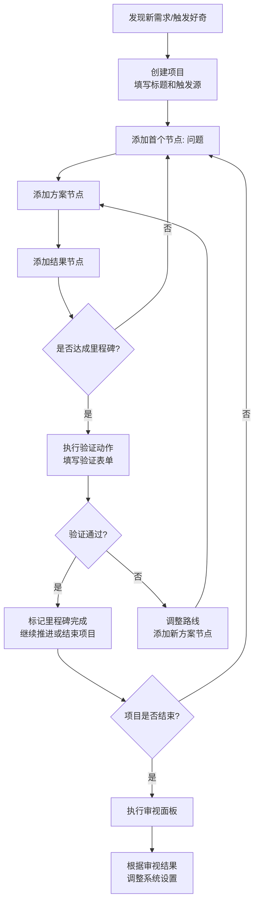

## 项目名称：个人任务管理系统（暂定）

### 1. 项目定位

一个面向“认知-实践”循环的个人任务管理工具，用于替代以时间为锚点的旧执行系统。核心理念源于马克思主义实践论：**从现实需求出发 → 理性分析 → 构建路线 → 实践检验 → 反馈修正**。同时融合休闲场景的“好奇驱动”模式，让学习、工作、休闲在统一框架下运行。

### 2. 核心设计原则

| 原则 | 说明 |
| :--- | :--- |
| **以项目为锚点** | 不以“今天/本周”为单位，而以“项目/里程碑”为基本单元 |
| **以验证为驱动** | 关注“是否验证了一个假设/解决了一个问题”，而非“是否坚持了多久” |
| **以动态修正为执行方式** | 计划根据实践反馈随时调整，不追求静态遵循 |
| **双轨记录** | 同时记录客观成果和主观感受，作为系统自我修正的依据 |

### 3. 项目模型（数据结构）

每个项目包含以下字段：

| 字段 | 类型 | 说明 |
| :--- | :--- | :--- |
| `id` | string | 唯一标识 |
| `title` | string | 项目名称 |
| `trigger` | string | **触发源**：记录启动这个项目的现实需求/感性触发是什么（如“看到某则新闻感到不公”或“对库里战术好奇”） |
| `status` | enum | `探索中` / `推进中` / `暂停` / `已完成` / `已弃用` |
| `nodes` | array | **节点链**：项目的核心结构，按时间顺序排列 |
| `milestones` | array | 里程碑索引（指向nodes中的特定位置） |
| `createdAt` | datetime | 创建时间 |
| `updatedAt` | datetime | 最后更新时间 |

**节点（Node）结构：**

| 字段 | 类型 | 说明 |
| :--- | :--- | :--- |
| `id` | string | 节点唯一标识 |
| `type` | enum | `问题` / `方案` / `结果` |
| `content` | string | 节点内容（具体问题、尝试的方案、取得的结果） |
| `status` | enum | `探索中` / `推进中` / `暂停` / `已完成` / `已弃用` |
| `log` | string | **附加日志**：记录此节点的成果、感受、经验教训 |
| `createdAt` | datetime | 节点创建时间 |

**验证动作（Validation）结构：**

每个里程碑节点需包含一个验证动作：

| 字段 | 类型 | 说明 |
| :--- | :--- | :--- |
| `method` | string | 验证方式（如“跑通Demo”“向他人解释清楚”“亲自操作一次”） |
| `criteria` | string | 通过标准（什么样的结果算通过） |
| `result` | enum | `通过` / `未通过` / `部分通过` |
| `feeling` | string | 对结果的感受（满意吗？意外吗？接下来想做什么？） |

### 4. 用户界面设计（四块面板）

**面板一：项目列表（主视图）**
- 以卡片或列表形式展示所有项目
- 每个项目显示：标题、状态标签、**进度条**（已完成节点 / 总节点数）或**星图**（★ 已点亮 / ☆ 未点亮）
- 支持按状态筛选：探索中 / 推进中 / 暂停 / 已完成 / 已弃用
- 点击项目进入详细视图

**面板二：项目详细视图**
- 顶部：项目标题 + 状态切换 + 进度可视化
- 中部：**节点链**按顺序显示，每个节点展示类型标签 + 内容 + 日志（可展开）
- 底部：新增节点按钮（选择类型：问题/方案/结果）
- 里程碑标记：在对应节点上显示里程碑标记，点击可触发验证表单

**面板三：审视面板**
- 在项目里程碑达成或项目结束时触发
- 显示三个审视问题：
  1. 当前整个项目面板的健康度如何？（状态分布是否合理？有无长期卡顿？）
  2. 最近的执行模式是否有问题？（是否在某个环节停留过久？）
  3. 系统本身是否需要调整？（里程碑划分、日志字段等）
- 审视记录保存为项目的一部分

**面板四：日志视图（可选）**
- 按时间线展示所有节点的日志条目，方便回顾和反思

### 5. 用户流程



### 6. 状态流转

```
探索中 → 推进中 → 已完成
   ↓         ↓         ↑
   ↓      暂停 → ──────┘
   ↓         ↓
   └────→ 已弃用
```

- **探索中**：尚未提炼出清晰问题，处于好奇/需求阶段
- **推进中**：已有明确问题和行动路线
- **暂停**：遇瓶颈或兴趣转移，未来可能重启
- **已完成**：验证通过，结果令人满意
- **已弃用**：验证失败或判断方向不对，主动终止

### 7. 技术实现建议（MVP范围）

- **数据持久化**：数据可先留存本地，后续探索在不租用服务器的前提下也能多端协同的方法
- **UI框架建议**：React + Tailwind（Web）或 SwiftUI（iOS）或 Flutter，取决于你的终端偏好
- **核心功能优先级**：
  1. 项目CRUD（创建、查看、更新状态、删除）
  2. 节点链管理（添加、编辑、排序）
  3. 进度条可视化
  4. 验证表单
  5. 审视面板
- **第一版可暂不实现**：用户认证、云端同步、多人协作

### 8. 目录结构建议（Web版）

```
/src
  /components
    ProjectList.jsx
    ProjectDetail.jsx
    NodeChain.jsx
    ValidationForm.jsx
    ReviewPanel.jsx
  /hooks
    useProjects.js     # 项目状态管理
    useNodes.js        # 节点操作
  /utils
    storage.js         # 本地存储封装
    projectHelpers.js  # 进度计算、状态判断等
  /types
    projectTypes.js    # TypeScript类型定义（可选）
  App.jsx
  main.jsx
```